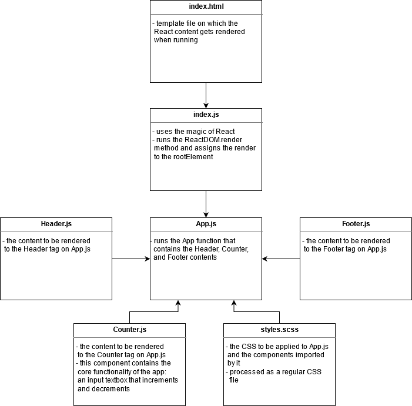

# Lab 22 — React Testing and Deployment

## React Counter with Testing and Deployment

Lab 21 and 22 for CF JS 401 Nights (n16)

### Author: Earl Jay Caoile

### Links and Resources

#### Submission Reqs

- [submission PR](https://github.com/earljay-caoile-401-advanced-javascript/react-counter/pull/2)
- [Netlify deployment](https://vigorous-swanson-a5a653.netlify.app/)
- [AWS S3 deployment](http://ecaoile-cf-js-stuff.s3-website-us-west-2.amazonaws.com/)

#### Resources

- [HTML Color Picker](https://www.w3schools.com/colors/colors_picker.asp)
- [HTML input tag](https://www.w3schools.com/tags/tag_input.asp)
- [how to make header and footer stay at top and bottom of page](https://stackoverflow.com/questions/643879/css-to-make-html-page-footer-stay-at-bottom-of-the-page-with-a-minimum-height-b)
- [vertical centering with flexbox](https://philipwalton.github.io/solved-by-flexbox/demos/vertical-centering/)
- [CSS borders](https://www.w3schools.com/css/css_border.asp)

### Documentation

- [React JS Hello World](https://reactjs.org/docs/hello-world.html)
- [SASS](https://sass-lang.com/)

### Setup

- install node packages locally with `npm i` from the root directory in Terminal
- start the server with `npm start`

### UML

