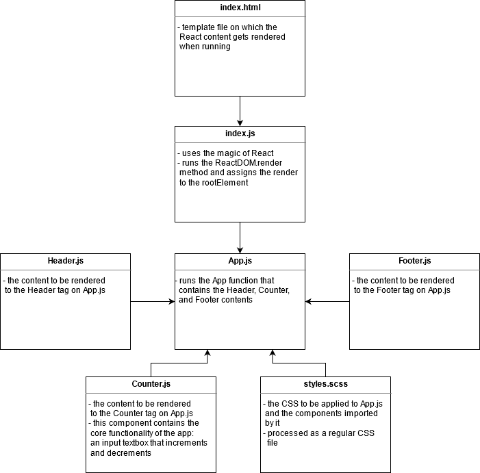

# Lab 21 — Component Based UI

## An Express server with basic and bearer authentication plus ACL!

Lab 10 to 14 for CF JS 401 Nights (n16)

### Author: Earl Jay Caoile

### Links and Resources

#### Submission Reqs

- [submission PR](https://github.com/earljay-caoile-401-advanced-javascript/react-counter/pull/3)
- [Sandbox](https://codesandbox.io/s/react-counter-pzcwc)

#### Resources

- [HTML Color Picker](https://www.w3schools.com/colors/colors_picker.asp)
- [HTML input tag](https://www.w3schools.com/tags/tag_input.asp)
- [how to make header and footer stay at top and bottom of page](https://stackoverflow.com/questions/643879/css-to-make-html-page-footer-stay-at-bottom-of-the-page-with-a-minimum-height-b)

### Documentation

- [React JS Hello World](https://reactjs.org/docs/hello-world.html)
- [SASS](https://sass-lang.com/)
- [using express middleware](https://expressjs.com/en/guide/using-middleware.html)

### Setup

- install node packages locally with `npm i` from the root directory in Terminal
- start the server with `npm start`

### UML

